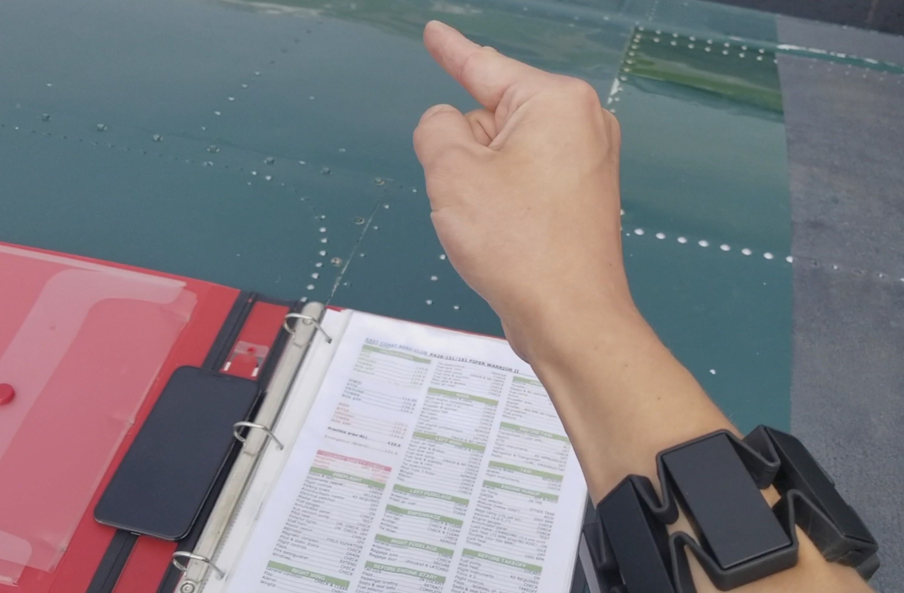
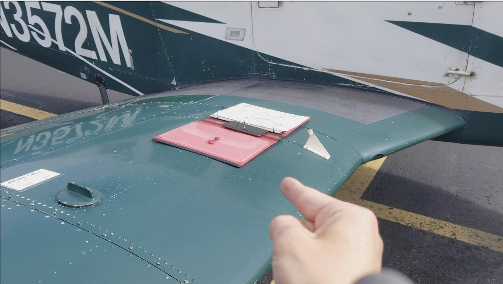

# PA28Checklist
Piper Warrior checklist on iPhone. This is the branch for Myo point to progress detection that's sweet. 

[Video here!](https://www.youtube.com/watch?v=WTW8HbnEK-w&list=PLbGg0dWfeEZuKKeUtlHhYtbBvO9TfU5Hj&index=1)

### The repo collection:

- [Data Collection App Repo](https://github.com/alist/MyoMLDataCollector)
- [Neural Net Training Scripts Repo](https://github.com/alist/myo_pointing_neural_net)
- [This Repo/ PA28 + Checklist Bracelet](https://github.com/alist/PA28Checklist)

### Pictures!

